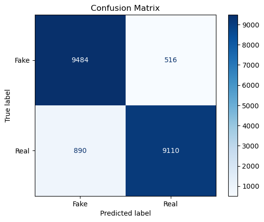

# Detecting Real vs AI-Generated Images Through Hyperparameter Tuning a Sequential Model

## Project Overview

This project focuses on differentiating between real and AI-generated images using computer vision techniques. The dataset contains 60,000 synthetically generated images and 60,000 real images collected from CIFAR-10. The goal is to leverage machine learning to detect whether an image is real or generated by AI.

## Data

The dataset was obtained from Kaggle (https://www.kaggle.com/datasets/birdy654/cifake-real-and-ai-generated-synthetic-images/data) and is divided into two classes - REAL and FAKE. The REAL images are sourced from Krizhevsky & Hinton's CIFAR-10 dataset, while the FAKE images are generated equivalent to CIFAR-10 using Stable Diffusion version 1.4. The dataset comprises 100,000 training images (50k per class) and 20,000 testing images (10k per class).

## Model

The project utilises a custom Sequential model constructed using Keras tuner. The model first includes a convolutional layer where the number of filters and kernel size are values to be tuned, followed by a pooling layer which is then flattened. Then there are two dense layers where the number of neurons and activation functions are to be tuned parameters. Finally, the model's learning rate and optimizer type are hyperparameter-tuned values. The goal of the model is to be capable of accurately classifying images as either real or AI-generated.

## Hyperparameter Optimisation

The following hyperparameters are tuned using Keras tuner:

Number of filters in the convolutional layer: Values from 20 and 100 with a step of 20 are tested to determine the optimal number of filters for the convolutional layer.

Kernel size in convolutional layer: An integer between 2 and 4 is tested for the optimal size of the kernel in the convolutional layer.

Dense layer input neurons: Values from 100 and 1000 with a step of 100 are tested to find the optimal number of neurons in each of the two dense layers.

Activation functions: The choice of activation functions for each dense layer are 'ReLU' and 'tanh'.

Learning rate: Three learning rates are tested during the tuning process, values 0.001, 0.0005 and 0.0001.

Optimizer Type: Two different optimization algorithms are tested, including the Adam optimizer and Stochastic Gradient Descent (SGD).

By exploring and optimizing these hyperparameters, the project aims to create a model with a combination of these hyperparameters that performs the best over the test data.

## Results

The best model found through the hyperparameter tuning method managed to achieve an accuracy of 92.97% on unseen test data, here is a breakdown of these results on the real and fake images in the form of a confusion matrix.

## Contact Details

Email: jacob.9.thomas@gmail.com
LinkedIn: www.linkedin.com/in/jacob-thomas-092402242
