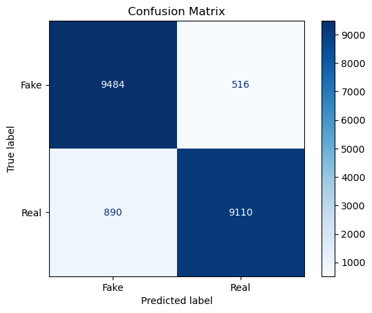

# Model Card

This model is designed to differentiate real images from AI-generated images. It analyses the images and predicts whether they are real or fake (AI-generated).

## Model Description

**Input:** Real and AI-generated images 

**Output:** Predicted class (real or fake)

**Model Architecture:** 

The model is a Sequential neural network consisting of the following components:

Convolutional Layer: This layer contains hyperparameter tuned values for both the number of filters as well as the kernel size, has a ReLU activation function and an input size of (32,32,3)

Pooling Layer: The image then goes through a max pooling layer, which is then flattened. 

Dense Layers: The model then contains two Dense layers where the number of neurons and activation functions are determined by hyperparameter tuning.

Output Layer: The final layer is a Dense layer with 2 outputs, corresponding to the 2 classes: real and fake. The activation function for this layer is a 'sigmoid' function. 

Learning Rate: The learning rate of the optimizer is found through hyperparameter tuning.

Optimizer: The choice of optimizer is found through hyperparameter tuning.

Compile and Metrics: After defining the architecture, the model is compiled using the specified optimizer and the loss function Sparse Categorical Cross-Entropy. The model tracks the 'accuracy' metric to monitor its performance during training.

## Performance

After the best model is found through the hyperparameter tuning process it is then trained on our training data:

Once this model is trained, the results are displayed by a confusion matrix:

